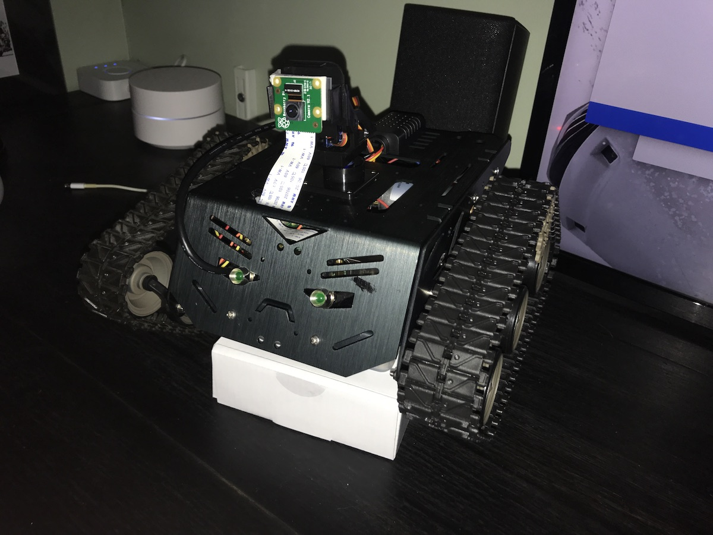

## RPi Robot

**Jimmy Bengtsson - jb223pu - 1DV527 - The web as an application platform**

### Description



[Client](http://109.228.145.167:5000)

I have built a small robot based on a platform called [Devastator](https://www.dfrobot.com/product-1477.html).
The robot has a DHT21-sensor that measure temperature and humidity. It is also connected to a Hue-bridge so it can measure temperature from Hue-sensors and also controll the light in my office.
You can control the robots motors, camera-servo and leds through http-requests. The robot also has a camera whick streams in HLS processed by FFMPEG.

### How

The client is built with React and handles all requests through Axios.
The server is based on a Express-application. Most of the available actions is made with help by the [Johnny Five](http://johnny-five.io) npm-module.

**Available HTTP-requests to server:**

```
GET /model
```
Get info about API

```
GET /actions/led/on
```
Turn on leds
```
GET /actions/led/off
```
Turn off leds
```
GET /actions/led/blink
```
Flash leds
```
GET /actions/hue/on
```
Turn on hue-light
```
GET /actions/hue/off
```
Turn off hue-light
```
GET /actions/hue/blink
```
Flash hue-light
```
GET /actions/camera/left
```
Turn camera to the left
```
GET /actions/camera/right
```
Turn camera to the right
```
GET /actions/camera/center
```
Center camera
```
GET /actions/motor/forward
```
Drive motors forward
```
GET /actions/motor/reverse
```
Reverse motors
```
GET /actions/motor/left
```
Drive motors to the left
```
GET /actions/motor/right
```
Drive motors forward to the right
```
GET /actions/motor/stop
```
Stop motors
```
GET /properties/temperature/latest
```
Latest temperature
```
GET /properties/humidity/latest
```
Latest humidity
```
GET /properties/sensor/all
```
Get all sensor-values
```
GET /properties/hue/latest
```
Latest Hue-values
```
GET /properties/hue/all
```
All Hue-values
```
GET /properties/hue/state
```
State of Hue-light


```
GET, PUT & DELETE /user
```
Get/update users info or delete the user.

**Required:** `x-access-token` has to be included in header

```
GET /user/assets
```
Get users all crypto-currency assets.

**Required:** `x-access-token` has to be included in header

```
POST /register
```
Create a new user.

**Required:** JSON.object with username and password in body of request.

**Example:** `{
        "userName": "username",
        "password": "password"
    }`

```
POST /login
```
Login user.

**Required:** JSON.object with username and password in body of request.

**Example:** `{
        "userName": "username",
        "password": "password"
    }`
    
```
WS /
```
Websocket that start the FFMPEG process when a user visit the client. Ends when user leaves.

### WoT

The robot has features like different actions, where you can control motors, servo, leds and hue-lights. And properties, where you can read temperature & humidity-values measured with a DHT21-sensor and Hue-sensors.
So by that, the robot supports the **Integration patterns**:

**Gateway integration -** Through sensors, motors, leds, and camera-servo connected to the Raspberry Pi.

**Direct integration -** The Raspberry Pi connects to a Hue-bridge through wifi.

And the different **Layers** are:

**Access -** JSON, WebSockets, HTTP, REST API

**Find -** HATEOAS, Web thing Model

**Share -** JWT

**Compose -** React application